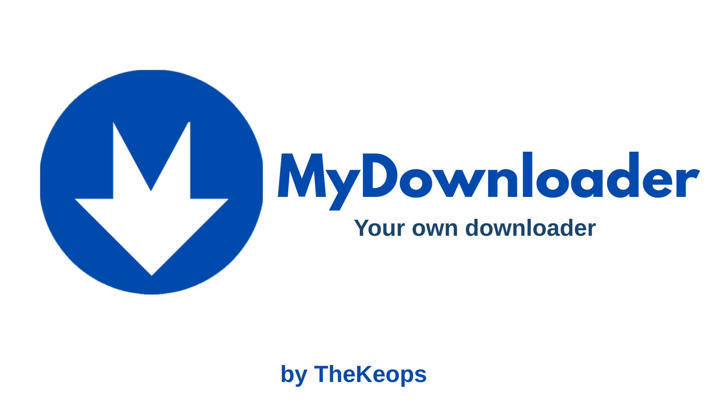

    

-
 

>[!IMPORTANT]
> Bu yazılım bir virüs değildir!

>[!IMPORTANT]
>Uygulamanın kendisi ile `MYDOWNLOADER` klasörünü aynı alanda tutun aksi halde uygulama kendi dosyasını 0'dan oluşturur.

>[!WARNING]
>Uygulamanın dosyalarını düzenleme yapmayın `app_data.txt` gibi dosyalar uygulamanın kontrol amaçlı dosyalarıdır müdahale halinde uygulama kendi dosyasını düzeltir fakat yenideb modül kurulumu işlemi başlar.

# MyDownloader Nedir?
MyDownloader uygulaması internet üzerinedn istediğiniz URL üzerineden dosyayı indirmeyi sağlayan bir uygulamadır. Uygulama basit ve sadedir ilerleyen zamanlarda geliştirilmeye ve güncelleme desteğine devam edilecektir. Dil desteği sadece Türkçe şimdilik eklenmiştir.

# Nasıl Kullanılır?
Öncelikle Dosya URL yazan yere istediğiniz dosyaın URL adresini giriniz ardından Dosya Adını kaydedeceğiniz adı giriniz ve indir tuşuna basınız. İndirme işlemi başladığında dosyayı nereye kaydedilmesini istediğiniz yolu seçin ve bitti. 

